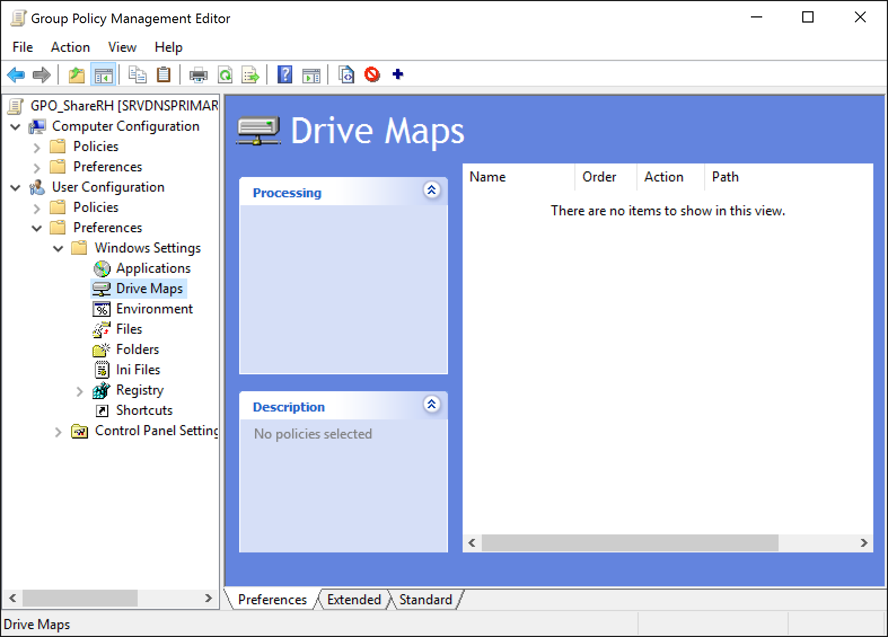
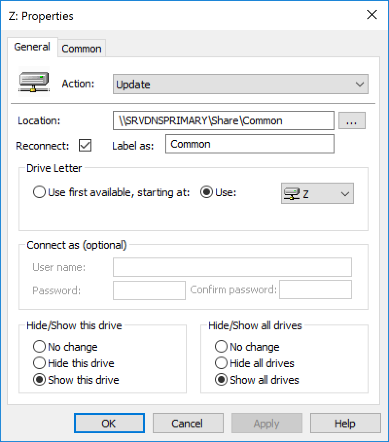

# GPO- Shared Folders as Drive

1. Open the **_Group Policy Management_** tool
2. Right Click on the chosen **OU**
    1. Choose _Create a GPO in this domain, and link it there…_
    2. Name it
3. Right click on the new **GPO** and choose _Edit_
4. You are now in the **_Group Policy Management Editor_**
    1. Got to **User Configuration**
    2. **Preferences**
    3. **Windows Settings**
    4. **Drive Maps**  
    Figure: 
5. Create a new one _(you can click on the **+**)_
6. Now, choose:
    1. The action: **Update**
    2. The location of the shared folder
    3. Check **Reconnect** and choose the **Drive letter**
    4. Finish by choosing **Show this drive** and **Show all drives**
    Figure: 
7. You can click on **Apply** and/or **OK**
8. Close the windows and **restart** your client

Source : [Microsoft's blog](https://blogs.technet.microsoft.com/askds/2009/01/07/using-group-policy-preferences-to-map-drives-based-on-group-membership/)
